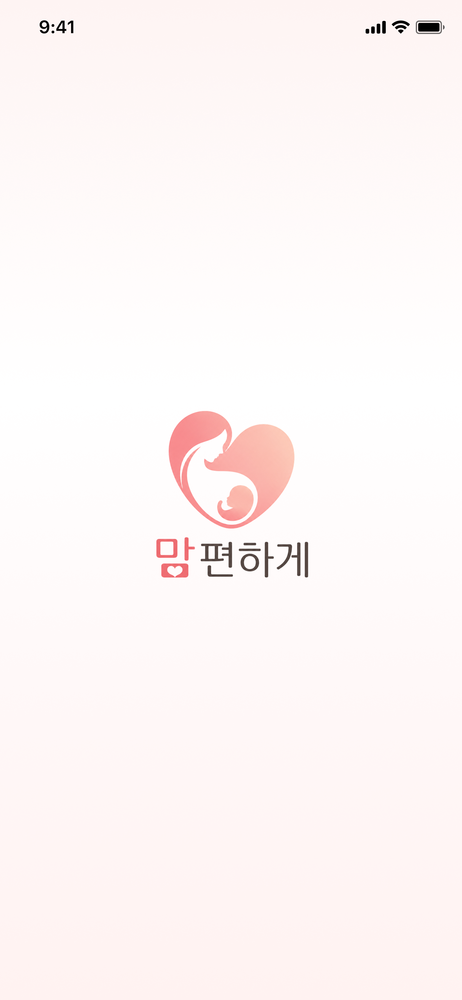
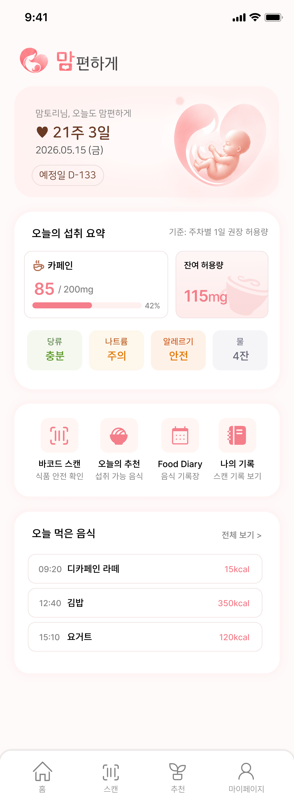
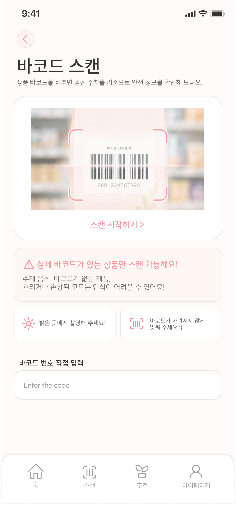
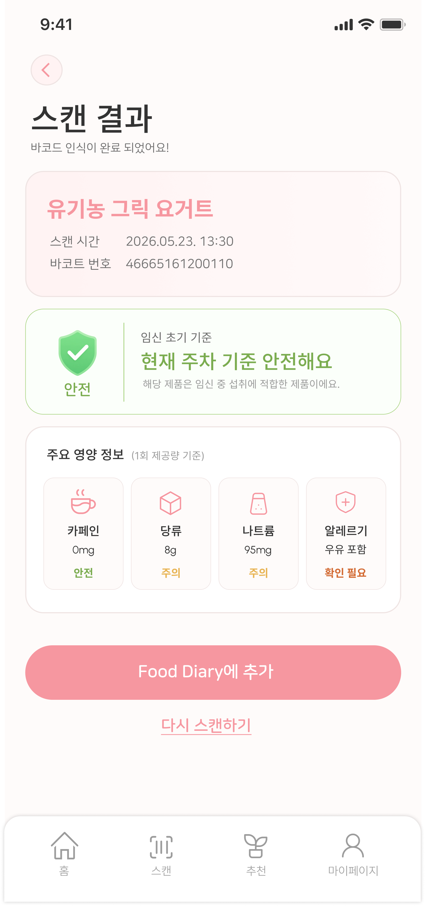
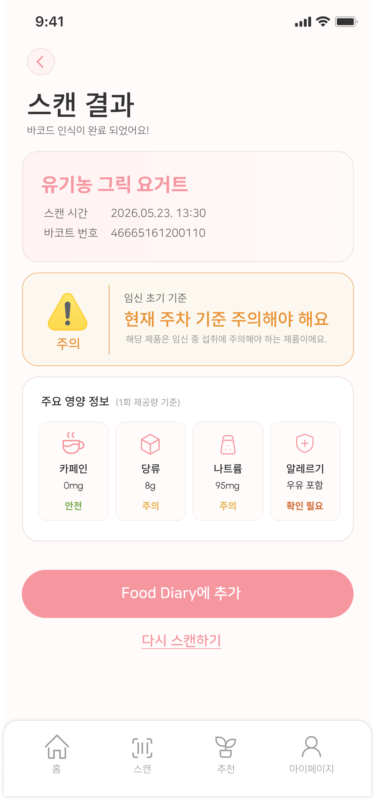
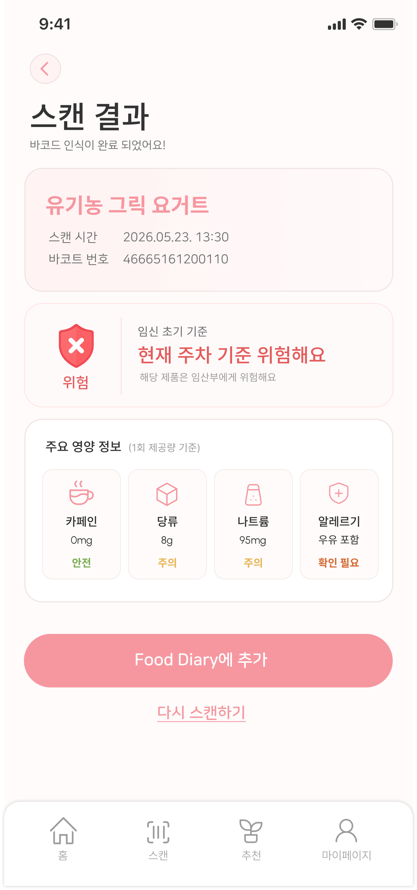

# 맘편하게 (Mompeace)

임신 중 식품 섭취를 더 안심하고 결정할 수 있도록 돕는 모바일 앱입니다.
식품을 검색하거나 바코드를 스캔하면, **오늘 하루 누적 섭취량(카페인·당류·나트륨)**과
**임신 주차**를 함께 고려해 해당 식품을 **섭취 가능(possible) / 주의(caution) / 비추천(avoid)**
중 하나로 안내합니다.

> 2학년 IT 경진대회 공모전 출품작으로 개발 중입니다.

## Screenshots

| 온보딩 | 홈 | 바코드 스캔 |
|---|---|---|
|  |  |  |

| 안전 | 주의 | 비추천 |
|---|---|---|
|  |  |  |

더 많은 화면은 [`example/`](example) 폴더에서 확인할 수 있습니다.

## Core Features

- **식품 안전 판정**: 바코드 스캔 또는 검색으로 식품을 찾으면, 오늘 누적 섭취량 + 임신 주차
  기준으로 섭취 가능 여부를 판정
- **개인 맞춤 민감도 조정**: 사용자 피드백을 바탕으로 영양소별 허용 기준을 점진적으로
  조정 (안전을 위해 더 관대해지는 방향으로만 자동 조정됨)
- **음식 다이어리**: 하루/주간 단위로 누적 섭취 패턴 확인
- **대체 식품 추천**: 비추천/주의 식품에 대해 비슷한 카테고리의 섭취 가능한 대안 제시
- **프리미엄 리포트**: (개발 중) 이미지로 내보낼 수 있는 섭취 리포트

## Architecture

식품 안전 판정은 **공식 가이드라인 기반 규칙 엔진**이 1차 판단을 내리고, 그 위에
**규칙 기반 안전장치**가 한 번 더 보정하는 2단 구조입니다. 규칙은 ACOG, EFSA,
한국인 영양소 섭취기준 등 공식 자료를 참고해 설계했습니다.

머신러닝(RandomForest)을 합성 라벨로 학습시켜 1차 판단에 쓰는 방식도 시도했지만,
합성 라벨 자체가 규칙으로 만들어진 것이라 모델이 실질적인 신호를 더하지 못한다는
점을 확인하고 제거했습니다. 현재는 규칙 엔진을 메인 판단 로직으로 두고, 향후
실사용자 피드백 데이터가 쌓이면 그 데이터를 활용한 **개인화 ML**(현재 구현된
`sensitivity.py`의 사용자별 민감도 조정이 그 시작 단계)로 확장하는 방향으로
진행하고 있습니다.

## Tech Stack

**백엔드**: FastAPI · SQLite · Python
**프론트엔드**: React Native (Expo) · expo-router · expo-camera
**외부 API**: 식품의약품안전처 FoodQR API, data.go.kr
**디자인**: Figma

## Getting Started

### Backend

```bash
cd backend
pip install -r requirements.txt
uvicorn backend.main:app --reload
```

### Frontend

```bash
cd app
npm install
npx expo start
```

## Project Structure

```
mompeace/
├── backend/          # FastAPI 서버
│   ├── main.py             # API 엔드포인트
│   ├── recommendation_model.py  # 식품 안전 판정 규칙 엔진
│   ├── sensitivity.py       # 사용자별 민감도 조정
│   ├── foodqr.py            # 식약처 FoodQR API 연동
│   └── ...
├── app/              # React Native (Expo) 앱
└── example/          # 화면 스크린샷
```

## Team

IT 경진대회 공모전 출품을 위해 개발 중입니다.
