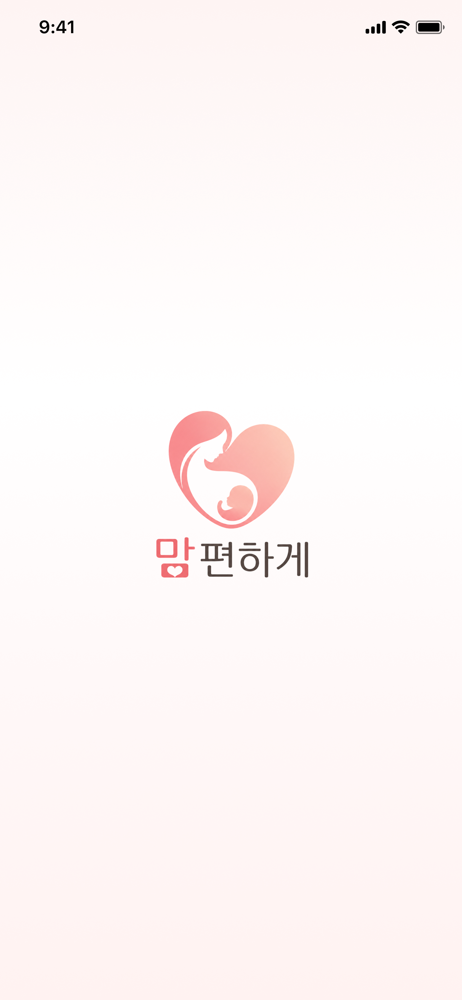
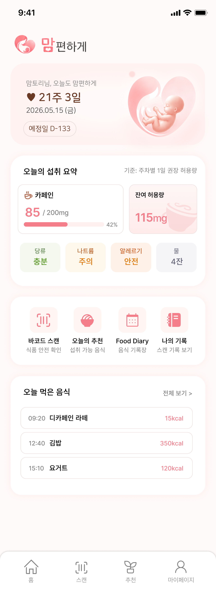
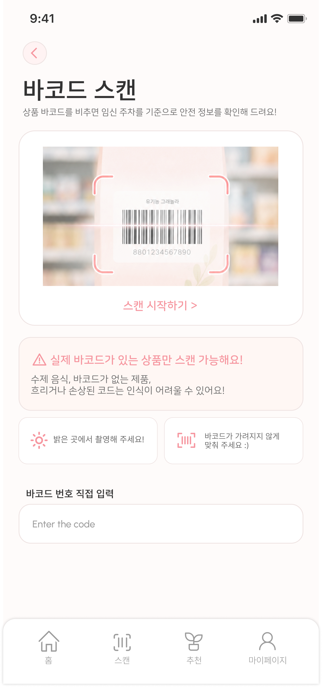
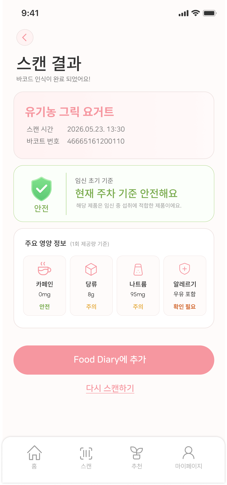
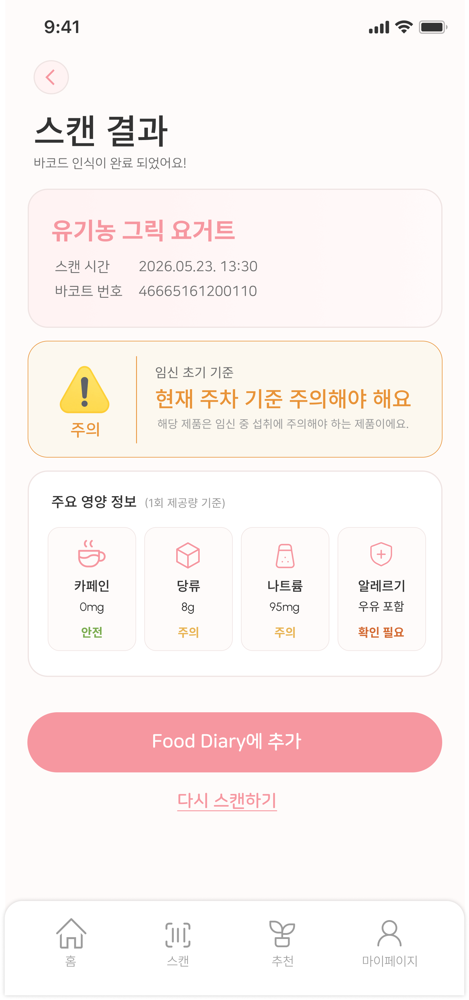
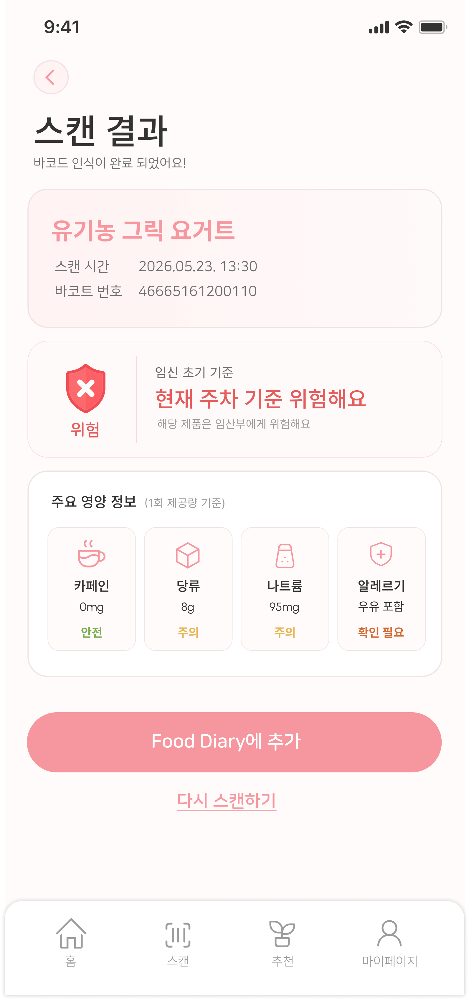

# 맘편하게 (Mompeace)

 임신 중 식품 섭취를 더 안심하고 결정할 수 있도록 돕는 모바일 앱입니다.
식품을 검색하거나 바코드를 스캔하면, **오늘 하루 누적 섭취량(카페인·당류·나트륨)**과
**임신 주차**를 함께 고려해 해당 식품을 **섭취 가능(possible) / 주의(caution) / 비추천(avoid)**
중 하나로 안내합니다.

## Screenshots

| 온보딩 | 홈 | 바코드 스캔 |
|---|---|---|
|  |  |  |

| 안전 | 주의 | 비추천 |
|---|---|---|
|  |  |  |

더 많은 화면은 [`example/`](example) 폴더에서 확인할 수 있습니다.

## Core Features

- **식품 안전 판정**: 바코드 스캔 또는 검색으로 식품을 찾으면, 오늘 누적 섭취량 + 임신 주차
  기준으로 섭취 가능 여부를 판정
- **개인 맞춤 민감도 조정**: 사용자 피드백을 바탕으로 영양소별 허용 기준을 점진적으로
  조정 (안전을 위해 더 관대해지는 방향으로만 자동 조정됨)
- **음식 다이어리**: 하루/주간 단위로 누적 섭취 패턴 확인
- **대체 식품 추천**: 비추천/주의 식품에 대해 비슷한 카테고리의 섭취 가능한 대안 제시
- **프리미엄 리포트**: (개발 중) 이미지로 내보낼 수 있는 섭취 리포트

## Architecture

 식품 안전 판정은 **공식 가이드라인 기반 규칙 엔진**이 1차 판단을 내리고, 그 위에
**규칙 기반 안전장치**가 한 번 더 보정하는 2단 구조입니다. 규칙은 ACOG, EFSA,
한국인 영양소 섭취기준 등 공식 자료를 참고해 설계했습니다.

 머신러닝(RandomForest)을 합성 라벨로 학습시켜 1차 판단에 쓰는 방식도 시도했지만,
합성 라벨 자체가 규칙으로 만들어진 것이라 모델이 실질적인 신호를 더하지 못한다는
점을 확인하고 제거했습니다. 현재는 규칙 엔진을 메인 판단 로직으로 두고, 향후
실사용자 피드백 데이터가 쌓이면 그 데이터를 활용한 **개인화 ML**(현재 구현된
`sensitivity.py`의 사용자별 민감도 조정이 그 시작 단계)로 확장하는 방향으로
진행하고 있습니다.

 임신 주차/일은 가입 시 입력한 값을 정적으로 저장하지 않고, 입력 시점(`pregnancy_entered_at`)
기준으로 경과일을 매 요청마다 계산해 항상 오늘 기준 값으로 반영되도록 설계했습니다.
트라이미스터(초기/중기/후기)는 두 가지 다른 방식으로 판정에 반영됩니다. 카페인·당류·나트륨의
일일 허용치 자체는 트라이미스터와 무관하게 단일 기준을 사용합니다 (카페인 200mg은 ACOG/EFSA,
당류는 한국인 영양소 섭취기준(KDRI)이 생애주기별 차등 근거가 부족하다고 명시한 데 따른 것이고,
나트륨도 KDRI 만성질환위험감소섭취량 기준을 단일 적용합니다 — ACOG·WHO·Cochrane 모두 나트륨
제한이 임신중독증 예방에 효과가 있다는 근거가 불충분하다고 보고 있어, 트라이미스터별로 허용치
자체를 차등하지는 않습니다).
 대신 트라이미스터별 차이는 **caution 신호를 띄우는 민감도**에 반영됩니다: 임신 초기에는
카페인이 일일 허용치의 60%를 넘으면 다른 영양소보다 먼저 주의 신호를 주는데, 이는 유산의
약 80%가 13주 이전에 발생하고 이 시기에 카페인 섭취 관련 우려가 가장 크다는 점을 반영한 것입니다.
임신 후기에는 나트륨이 80%를 넘으면 주의 신호를 주는데, 이는 나트륨 자체를 더 엄격히 제한해야
한다는 의미가 아니라 이 시기에 부종 등 증상을 더 면밀히 살펴보자는 모니터링 차원의 신호입니다.

 영양소 정보가 없는 음식과 실제로 함량이 0인 음식은 명확히 구분합니다. 정보가 없는
경우 0으로 간주해 안전하다고 표시하지 않고, "정보없음" 상태로 별도 표시해 사용자가
직접 확인하도록 안내합니다. 안전을 다루는 앱에서 불확실성을 안전한 값으로 둔갑시키지
않는 것이 중요하다고 판단했습니다.

## Tech Stack

**백엔드**: FastAPI · SQLite · Python
**프론트엔드**: React Native (Expo) · expo-router · expo-camera
**외부 API**: 식품의약품안전처 FoodQR API, data.go.kr
**디자인**: Figma

## Getting Started

### Backend

```bash
cd mompeace  # 프로젝트 루트 (backend/ 폴더가 아님)
pip install -r backend/requirements.txt
uvicorn backend.main:app --reload
```

같은 네트워크의 휴대폰(Expo Go)에서 접속하려면 `--host 0.0.0.0`을 붙여 LAN의
다른 기기에서도 접근할 수 있도록 해야 합니다:

```bash
uvicorn backend.main:app --reload --host 0.0.0.0 --port 8000
```

### Frontend

```bash
cd app
npm install
npx expo start
```

## Project Structure

```
mompeace/
├── backend/          # FastAPI 서버
│   ├── main.py             # API 엔드포인트
│   ├── recommendation_model.py  # 식품 안전 판정 규칙 엔진
│   ├── sensitivity.py       # 사용자별 민감도 조정
│   ├── foodqr.py            # 식약처 FoodQR API 연동
│   └── ...
├── app/              # React Native (Expo) 앱
└── example/          # 화면 스크린샷
```
